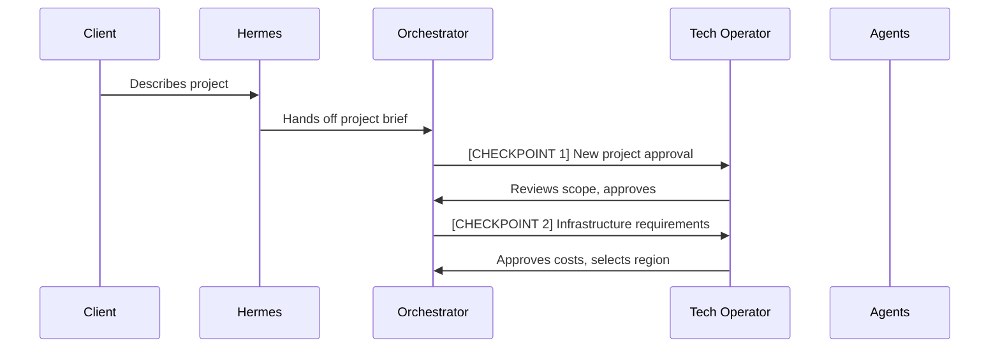
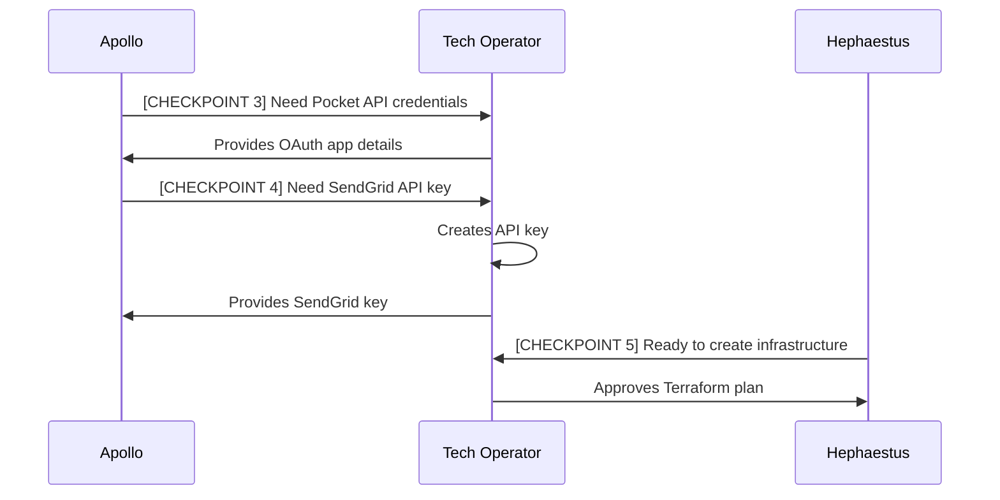
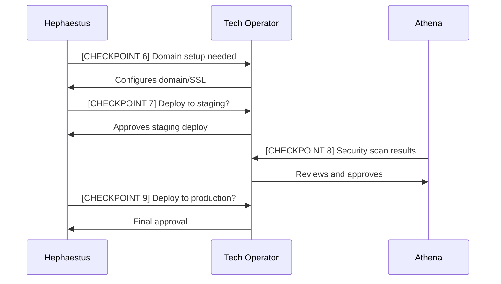
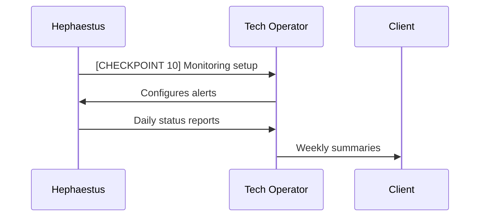

# Technical Operator Flow - Human-in-the-Loop Design

## Overview

The **Technical Operator (TO)** is an internal technical team member who handles all aspects that AI agents cannot perform autonomously. This role bridges the gap between AI automation and real-world deployment requirements.

## Role Definition

### Technical Operator (Internal - Not Client)
- **Purpose**: Handle credentials, approvals, and manual technical tasks
- **Expertise**: DevOps, cloud platforms, security, API integrations
- **Availability**: Async communication with agents (not real-time)
- **Authority**: Can approve costs, create resources, access secure systems

### Key Responsibilities
1. **Credential Management** - API keys, OAuth flows, service accounts
2. **Infrastructure Approval** - Cost approval, resource provisioning
3. **Security Gates** - Review and approve security-sensitive operations
4. **Manual Operations** - Tasks requiring human verification or access
5. **Troubleshooting** - Debug issues AI agents can't resolve

## Standard Project Flow (90% Cases)

### Phase 1: Project Initialization



**TO Checkpoint 1: Project Approval**
```
Message from Orchestrator:
"New project: Read Later Digest
Estimated infrastructure cost: $45-60/month
Required services: AWS (ECS, RDS, SQS, Lambda)
Required APIs: Pocket, SendGrid, OpenAI
Approve to proceed? [Y/N]"

TO Actions:
- Review cost estimate
- Verify service availability
- Approve or request modifications
```

**TO Checkpoint 2: Infrastructure Setup**
```
Message from Orchestrator:
"Infrastructure needed:
- AWS Region: [Select: us-east-1, us-west-2, eu-west-1]
- Database: PostgreSQL 13 (db.t3.micro)
- Container service: ECS Fargate
- Queue: SQS
- Estimated setup time: 15 minutes
Proceed with provisioning? [Y/N]"

TO Actions:
- Select region based on client location
- Approve resource sizes
- Initiate provisioning
```

### Phase 2: Development



**TO Checkpoint 3-4: API Credentials**
```
Message from Apollo:
"Need Pocket API access:
1. Create app at: https://getpocket.com/developer/
2. App name: 'Client Project - Read Later Digest'
3. Permissions needed: Retrieve
4. Callback URL: https://[pending-domain]/auth/pocket/callback

Please provide:
- Consumer Key: ___________
- Redirect URI: ___________"

TO Actions:
- Create developer account if needed
- Register application
- Copy credentials to secure vault
- Provide to agent via secure channel
```

**TO Checkpoint 5: Infrastructure Approval**
```
Message from Hephaestus:
"Terraform plan ready:
+ aws_ecs_cluster.main
+ aws_rds_instance.postgres (db.t3.micro)
+ aws_sqs_queue.jobs
+ aws_ecr_repository.app
+ aws_iam_role.ecs_task (3 roles)
+ aws_security_group.app (2 groups)

Estimated monthly cost: $47.23
Apply infrastructure? [Y/N]"

TO Actions:
- Review Terraform plan
- Verify security groups
- Check cost calculation
- Execute: terraform apply
```

### Phase 3: Deployment



**TO Checkpoint 6: Domain Configuration**
```
Message from Hephaestus:
"Domain configuration needed:
1. Add DNS records to client's domain:
   - A record: digest.client.com → 34.123.45.67
   - CNAME: www.digest.client.com → digest.client.com
2. Or use our subdomain:
   - digest.aiagency.app (automatic SSL)

Which option? [custom/subdomain]"

TO Actions:
- Coordinate with client for custom domain
- Or provision subdomain
- Configure SSL certificate
- Update OAuth redirect URLs
```

**TO Checkpoint 9: Production Deployment**
```
Message from Hephaestus:
"Ready for production deployment:
✅ All tests passing (47/47)
✅ Security scan clean
✅ Staging environment verified
✅ Database migrations ready
✅ Rollback plan prepared

Deploy to production? [Y/N]"

TO Actions:
- Final review of staging
- Verify backups
- Approve deployment
- Monitor initial traffic
```

### Phase 4: Post-Deployment



## Standard Checkpoints Summary

### Always Required (Every Project)
1. **Project Approval** - Scope and cost approval
2. **Infrastructure Selection** - Region, services, sizing
3. **API Credentials** - External service authentication
4. **Infrastructure Creation** - Terraform/CloudFormation approval
5. **Production Deployment** - Final go-live approval

### Often Required (80% of Projects)
6. **Domain Setup** - DNS and SSL configuration
7. **Security Review** - Scan results and fixes
8. **Database Migration** - Schema changes approval
9. **Monitoring Setup** - Alerts and thresholds
10. **Cost Optimization** - Post-launch adjustments

### Sometimes Required (30% of Projects)
11. **Compliance Review** - GDPR, HIPAA, etc.
12. **Load Testing** - Performance validation
13. **Third-party Integrations** - Complex OAuth flows
14. **Data Migration** - From existing systems
15. **Custom Infrastructure** - Non-standard requirements

## Communication Protocol

### Agent → TO Messages

**Format**:
```
[CHECKPOINT N] Action Required: <brief description>
Project: <project_name>
Agent: <agent_name>
Priority: <HIGH|MEDIUM|LOW>
Deadline: <time_estimate>

Details:
<specific request with clear actions needed>

Options:
1. <option_1>
2. <option_2>

Provide response in thread.
```

### TO → Agent Responses

**Format**:
```
[CHECKPOINT N] Response
Decision: <decision made>
Details: <any relevant information>
Credentials: <secure_link_if_applicable>
Next steps: <what agent should do>
```

## Credential Handling

### Secure Credential Flow
1. **Never in chat** - Use secure vault links
2. **Temporary access** - Credentials expire after use
3. **Audit trail** - All access logged
4. **Encrypted storage** - At rest and in transit
5. **Principle of least privilege** - Only what's needed

### Vault Integration
```python
# Agents request credentials
vault_link = await request_credential(
    project_id="proj_123",
    credential_type="api_key",
    service="sendgrid",
    expires_in_minutes=30
)

# TO approves and provides
await approve_credential_request(
    request_id="req_456",
    credential_value=encrypted_key,
    restrictions=["ip_whitelist": ["10.0.0.0/8"]]
)
```

## Error Escalation

### When Agents Escalate to TO

1. **Authentication Failures**
   - API keys rejected
   - OAuth flow errors
   - Expired tokens

2. **Infrastructure Issues**
   - Provisioning failures
   - Network problems
   - Resource limits

3. **Deployment Blocks**
   - Failed health checks
   - Security violations
   - Cost overruns

4. **Integration Problems**
   - API changes
   - Rate limiting
   - Service outages

### TO Response SLA

- **Critical (Production Down)**: 15 minutes
- **High (Blocking Development)**: 2 hours
- **Medium (Non-blocking)**: 4 hours
- **Low (Optimizations)**: 24 hours

## Tools for Technical Operator

### Dashboard Access
- Infrastructure overview
- Cost tracking
- Agent activity logs
- Checkpoint history
- Credential manager

### Automation Scripts
```bash
# Quick actions for common tasks
./to-tools/approve-checkpoint.sh <checkpoint_id>
./to-tools/provision-api-key.sh <service> <project>
./to-tools/deploy-staging.sh <project>
./to-tools/rollback-production.sh <project>
```

### Monitoring Integration
- Slack/Discord alerts for checkpoints
- Mobile app for approvals
- Email digests of pending actions
- Escalation to backup TO

## Cost Management

### TO Cost Approval Matrix

| Monthly Cost | Approval Required | Review Frequency |
|-------------|------------------|------------------|
| <$50 | Auto-approved | Monthly |
| $50-200 | TO approval | Bi-weekly |
| $200-500 | TO + Manager | Weekly |
| >$500 | TO + Manager + Client | Daily |

### Cost Optimization Triggers
- Alert at 80% of budget
- Daily reports if over budget
- Automatic scaling suggestions
- Resource rightsizing recommendations

## Security Protocols

### TO Security Responsibilities

1. **Access Control**
   - MFA for all TO accounts
   - Regular access reviews
   - Temporary elevated privileges
   - IP restrictions

2. **Audit Requirements**
   - All actions logged
   - Monthly access reports
   - Compliance documentation
   - Incident response plan

3. **Secret Rotation**
   - Quarterly API key rotation
   - Automated where possible
   - TO manages manual rotations
   - Zero-downtime updates

## Efficiency Optimizations

### Reducing TO Workload

1. **Templates and Automation**
   - Pre-approved infrastructure templates
   - Automated API key creation where possible
   - One-click approvals for common requests
   - Bulk operations for similar projects

2. **Smart Defaults**
   - Region selection based on client location
   - Standard sizing for project types
   - Pre-configured security groups
   - Common service selections

3. **Parallel Processing**
   - Batch similar checkpoints
   - Async approval workflows
   - Pre-provisioning common resources
   - Checkpoint bundling

## Training and Onboarding

### TO Training Requirements

1. **Platform Knowledge**
   - AWS/GCP/Azure basics
   - Terraform/Infrastructure as Code
   - Container orchestration
   - CI/CD pipelines

2. **Security Best Practices**
   - Credential management
   - Network security
   - Compliance requirements
   - Incident response

3. **Tool Proficiency**
   - Vault systems
   - Monitoring platforms
   - Deployment tools
   - Communication systems

### Runbooks for Common Tasks

1. **Project Setup Runbook**
2. **API Integration Runbook**
3. **Deployment Runbook**
4. **Incident Response Runbook**
5. **Cost Optimization Runbook**

## Success Metrics

### TO Performance Metrics
- **Response Time**: Average time to checkpoint resolution
- **Error Rate**: Percentage of failed deployments
- **Cost Variance**: Actual vs estimated costs
- **Security Score**: Compliance and incident rate
- **Automation Rate**: Percentage of automated vs manual tasks

### Project Success Correlation
- Projects with faster TO response → Higher success rate
- Clear checkpoint communication → Fewer errors
- Proactive TO involvement → Lower costs
- Regular reviews → Better security

## Future Automation Roadmap

### Phase 1 (Current)
- Manual TO involvement at all checkpoints
- Human approval for all resources
- Manual credential management

### Phase 2 (6 months)
- Automated provisioning for approved templates
- API key vault with auto-rotation
- One-click deployments for standard stacks
- Reduced checkpoints to 5-6 per project

### Phase 3 (12 months)
- Self-service portal for clients
- AI-suggested infrastructure sizing
- Automated security scanning and fixes
- TO only for exceptions

### Phase 4 (18 months)
- Full automation for standard projects
- TO becomes exception handler only
- AI handles routine approvals
- Human only for complex decisions

---

This TO flow ensures we can deliver real projects while maintaining security, cost control, and quality. The key is making the TO role efficient through good tooling and clear protocols.